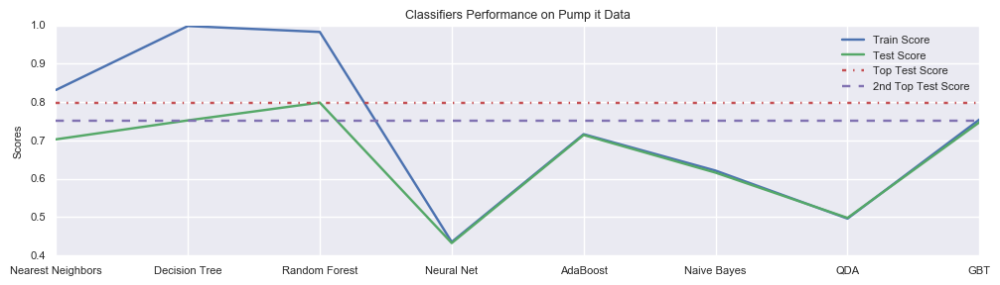
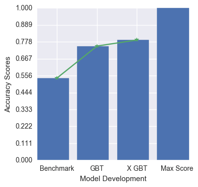
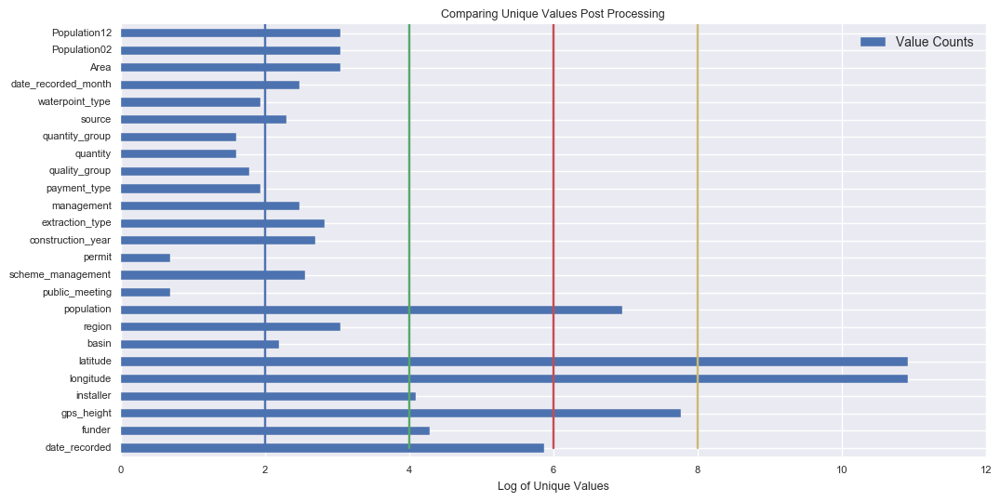

# Machine Learning Engineer Nanodegree

## Capstone Project

Sampath Kumar

January 6th, 2017


Keywords: Statistics(stats), Labeling, Transformation, Sklearn, Scikit, Variance Threshold(VT), Chi2, F1 Score, Random Forest(RF), Gradient Boosting(GBT/GB), Xgboost.

## Definition

### Project Overview

Across Africa, cholera, typhoid, dysentery and other diseases kill thousands each year. To help the people of Tanzania(2007), The Tanzanian government, with support from UN Development Programme(UNDP), responded to the water problems by the installation of Drinking Water Taps and Decentralized the maintenance for a quick response. Today this water infrastructure is facing repair and maintenance issues causing a disconnection for drinking water needs.

The Taarifa Platform is an open source web API, designed to close citizen feedback loops. Using Taarifa people can report their social issues(like water, electricity, food and other) from different forms of communications like SMS, Web Forums, Emails or Twitter. Later these reports are placed into a work flow where they can be followed up and acted upon while engaging citizens and community. A message then will to local central governing body notifying the issue & the location.

<!-- ![Image][water_pump_with_kids] -->

In this Project, we will be using the well known algorithms like [Random Forest](https://www.stat.berkeley.edu/~breiman/randomforest2001.pdf), [Gradient Boosting Trees](https://www.cse.cuhk.edu.hk/irwin.king/_media/presentations/2001_greedy_function_approximation_a_gradient_boosting_machine.pdf), [Support Vector Machines](http://research.microsoft.com/en-us/um/people/cburges/papers/svmtutorial.pdf) and [Xgboost](https://xgboost.readthedocs.io/en/latest/). External Resources, where you can find the code and scripts used are available in below links.

1. [Benchmark (Data Load + Clean Up + Algorithm)][PumpIt01]
2. [Data Analysis][PumpIt02]
3. [Manual Data Transformations (Data Load + Clean Up + Algorithm)][PumpIt03]
4. [Analysis of Algorithm Selection and Comparison][PumpIt04]
5. [Algorithmic Features Selection & Hyper Parameter Tuning][PumpIt05]


__Personal Motivation__: When I was a child, I used see lots of common people standing in long queue for drinking water. May be it was the first time I have ever seen people struggling for drinking water till late evenings(like the above image show), on that day I did not know how to help them. Every time I read about this problem statement I still do feel the same way. We realize that trying a few algorithms and feature engineering techniques might not solve this problem of fixing the water issues of our fellow beings in Tanzania, but we hope and expect that this project to serve as a platform for building tools for proactive identifying .

> What we do is less than a drop in the ocean. But if it were missing, the ocean would lack something.  - Mother Teresa

### Problem Statement

Using the data gathered from Taarifa and the Tanzanian Ministry of Water, can we predict which pumps are functional, which need some repairs, and which don't work at all? Predicting one of these three classes that might have caused the failure of a water pump, can improve the maintenance operations to well prepare and ensure that clean, potable water is available to communities across Tanzania.

This project is inspired by [DataDriven][datadriven7]! From logical perspective, as we can understand we are looking at a __Supervised Multi Label Classification problem__ and our goal is identifying which label, out of 3 possible labels is the cause for an issues entry in Taarifa complaints records. <!--  So based on the features and size of dataset, our course of action would be to identify a classifier out of many different kinds of classifiers which could understand and predict well. --> <!--
As shown in below image, we are going to do a step by step development progress on here.
![Udacity Machine Learning Course Plan][udacity_ml_course_plan] -->

Few key things to note:
* Multi Label Prediction
* Taarifa complaints records(Manually added data though a Social Application Platform)

As observed from dataset given by Taarifa and DataDriven, most of the data is labeled data and would need concise text processing for improving data quality in a way that an AI Machine Learning Algorithm can understand & see patterns in data. So for improving the quality of data, first we need a reference benchmark point score to look and keep improving our data quality and progress towards build a solution. After setting a benchmark, we explore few well known Algorithms and followed by some further improvements of features selection and parameter tuning. As we believe good data is what generates a good model, we will try to focus more on building good quality data set.

### Metrics

Before we begin metrics selection, lets look at the distribution of labels in the data. The labels in this dataset are simple. There are three possible values:

* functional - the waterpoint is operational and there are no repairs needed
* functional needs repair - the waterpoint is operational, but needs repairs
* non functional - the waterpoint is not operational


In multi-class classification class imbalance effects more easily the typical performance metrics. As per competition posted by Data Driven suggests a simple Accuracy, given its imbalanced classes. So we have added a small wrapper function to provide both Scores for understanding a models performance, while Accuracy score is focuses on overall model performance, we added F1 Score to focus on balanced precision and recall scores in according to each classes distribution.

#### Micro F1 Score

The [F1 Score][F1_Score] can be interpreted as a weighted average of the precision and recall, where an F1 score reaches its best value at 1 and worst score at 0. The relative contribution of precision and recall to the F1 score are equal. The formula for the F1 score is:

```
F1 = 2 * (precision * recall) / (precision + recall)
```

As this is a multi class classification for averaging (`average` parameter of [sklearn.metric.f1_score](http://scikit-learn.org/stable/modules/generated/sklearn.metrics.f1_score.html)) the score, we need to choose one of existing methods like binary, micro, macro, weighted and samples. As stated in SKlearn, F1 Micro calculate metrics globally by counting the total true positives, false negatives and false positives. So we have opted for F1 Score Micro.


``` python
>>> from sklearn.metrics import f1_score
>>> y_true = [0, 1, 2, 0, 1, 2]
>>> y_pred = [0, 2, 1, 0, 0, 1]
>>> f1_score(y_true, y_pred, average='macro')
0.26...
>>> f1_score(y_true, y_pred, average='micro')
0.33...
>>> f1_score(y_true, y_pred, average='weighted')
0.26...
>>> f1_score(y_true, y_pred, average=None)
array([ 0.8,  0. ,  0. ])
```

#### Accuracy Score

Accuracy classification score.

As the suggested evaluation metric of the competition, we use [Accuracy Score][accuracy_score] /Classification Rate metric.

The classification rate, which calculates the percentage of rows where the predicted class in the submission matches the actual class in the test set. The maximum is 1 and the minimum is 0. The goal is to maximize the classification rate.

<math display="block">
    <mi>Classification Rate</mi>
    <mo>=</mo>
    <msubsup><mi>(1/N)* ∑</mi>
    </msubsup>
    <msubsup><mi> I(Prediction == Actual)</mi>
    </msubsup>
</math>

</br>
Example from Python Scikit [Accuracy Score][accuracy_score]

``` python
>>> import numpy as np
>>> from sklearn.metrics import accuracy_score
>>> y_pred = [0, 2, 1, 3]
>>> y_true = [0, 1, 2, 3]
>>> accuracy_score(y_true, y_pred)
0.5
>>> accuracy_score(y_true, y_pred, normalize=False)
2
```

In the code comments, we shall denote Accuracy Score as __AC Score__ and F1 Score as __F1 Score__.


## Analysis

Source/data files are available at [DataDriven][datadriven7]


|File|Description|
|----|-----------|
|[Training set values][input_file1]|The independent variables for the training set|
|[Training set labels][input_file2]|The dependent variable (status_group) for each of the rows in Training set values|
|[Test set values][input_file3]|The independent variables that need predictions|
|[Submission format][input_file4]|The format for submitting your predictions|

### Data Exploration

Test & Train data sets consists of 39 columns each with 59400 rows and  14850 rows respectively, to predict 1 multi-labeled column.

Here is some simple analysis of columns along with some sample data. As the input data mostly consists of categorical data, for each we have also taken unique groups counts (or value counts) and plotted in horizontal bar charts for easy read.

__Description of the Features__

|Index|Column Name|Unique Values|Sample Data|
|-----|-----------|-------------|-----------|
|0|amount_tsh|98| ['6000', '0', '25']|
|1|date_recorded|356| ['2011-03-14', '2013-03-06', '2013-02-25']|
|2|funder|1897| ['Roman', 'Grumeti', 'Lottery']|
|3|gps_height|2428| ['1390', '1399', '686']|
|4|installer|2145| ['Roman', 'GRUMETI', 'World']|
|5|longitude|57516| ['34.9381', '34.6988', '37.4607']|
|6|latitude|57517| ['-9.85632', '-2.14747', '-3.82133']|
|7|wpt_name|37400| ['none', 'Zahanati', 'Kwa']|
|8|num_private|65| ['0', '0', '0']|
|9|basin|9| ['Lake', 'Nyasa', 'Lake']|
|10|subvillage|19287| ['Mnyusi', 'B', 'Nyamara']|
|11|region|21| ['Iringa', 'Mara', 'Manyara']|
|12|region_code|27| ['11', '20', '21']|
|13|district_code|20| ['5', '2', '4']|
|14|lga|125| ['Ludewa', 'Serengeti', 'Simanjiro']|
|15|ward|2092| ['Mundindi', 'Natta', 'Ngorika']|
|16|population|1049| ['109', '280', '250']|
|17|public_meeting|2| ['True', 'NaN', 'True']|
|18|recorded_by|1| ['GeoData', 'Consultants', 'Ltd']|
|19|scheme_management|12| ['VWC', 'Other', 'VWC']|
|20|scheme_name|2696| ['Roman', 'NaN', 'Nyumba']|
|21|permit|2| ['False', 'True', 'True']|
|22|construction_year|55| ['1999', '2010', '2009']|
|23|extraction_type|18| ['gravity', 'gravity', 'gravity']|
|24|extraction_type_group|13| ['gravity', 'gravity', 'gravity']|
|25|extraction_type_class|7| ['gravity', 'gravity', 'gravity']|
|26|management|12| ['vwc', 'wug', 'vwc']|
|27|management_group|5| ['user-group', 'user-group', 'user-group']|
|28|payment|7| ['pay', 'annually', 'never']|
|29|payment_type|7| ['annually', 'never', 'pay']|
|30|water_quality|8| ['soft', 'soft', 'soft']|
|31|quality_group|6| ['good', 'good', 'good']|
|32|quantity|5| ['enough', 'insufficient', 'enough']|
|33|quantity_group|5| ['enough', 'insufficient', 'enough']|
|34|source|10| ['spring', 'rainwater', 'harvesting']|
|35|source_type|7| ['spring', 'rainwater', 'harvesting']|
|36|source_class|3| ['groundwater', 'surface', 'surface']|
|37|waterpoint_type|7| ['communal', 'standpipe', 'communal']|
|38|waterpoint_type_group|6| ['communal', 'standpipe', 'communal']|


(These 39 column's unique values counts)(98, 356, 1897, 2428, 2145, 57516, 57517, 37400, 65, 9, 19287, 21, 27, 20, 125, 2092, 1049, 2, 1, 12, 2696, 2, 55, 18, 13, 7, 12, 5, 7, 7, 8, 6, 5, 5, 10, 7, 3, 7, 6)
(542989639101365927794152062178992491838404172880830791680000000000000(69 digits) is product of these 39 unique values, which is exponentially greater than 59K records we have) is the ideal amount of sufficient data to cover each and every category.

Input labels data has 39(27 object columns and 16 non-object columns) Features with 59,400 rows. Although we seem to have a good data set, looking at the unique values counts from below 39 columns we can say that we could potentially encounter Curse of Dimensionality. But, as we can see some of columns pairs (extraction\_type, extraction\_type\_group), (quantity & quantity\_group), (source, source\_class) seems have closer relation and column by 'recorded\_by' has only one unique value. So, we might have a chance to escape Curse of Dimensionality.


__Description of the Labels__

The labels in this dataset are simple. There are three possible values for status_group:

* functional - the water point is operational and there are no repairs needed
* functional needs repair - the water point is operational, but needs repairs
* non-functional - the water point is not operational


|PredictionLabels|Counts|Percentage|
|-----------------|------|----------|
|functional|32259|54.30|
|non functional|22824|38.42|
|functional needs repair|4317|07.26|

As numbers show we have data for unequal proportions. So the in normal circumstances if we train a model to learn the there might be changes where model tried to predict only first two groups which would only include ~92% data for learning.

To create a generic model which could work in all scenario, we will use stratification selection for splitting test-train data.

### Exploratory Visualization

Visualization of Object Columns Value Counts.

![Image][cols_value_counts]

Bar plot of all Object Column's Value counts.
__ NOTES:__ Values shown in image are log transformed to show differences visually.
![Image][features_vc_compare]

Histogram of all Object Column's Value counts.

![Image][features_vc_histogram]


__Observations:__

 * scheme_name has too many null values.
 * longitude has zeros which is not possible.
 * public_meetings, permit, amount_tsh, gps_height, population, construction_year columns required interfiling of data has lots of outliers(as zeros)
 * wpt_name, ward, subvillage, schema_name, installer, funder has lots of categorical values

Few columns which seems to hold similar kind of information

* extraction_type, extraction_type_group, extraction_type_class
* management, management_group
* scheme_management, scheme_name
* payment_type, payment
* quality_group, water_quality
* source, source_type, source_class
* waterpoint_type, waterpoint_type_group


__Geo Location information:__ All following parameter are available for same reason, to find the address.

 * longitude, latitude
 * region
 * district_code within region
 * ward
 * subvillage

Compared to all other Location columns `regions` columns has complete data.


### Algorithms and Techniques

As described in the introduction, a smart understanding of which water points will fail can improve maintenance operations and ensure that clean, potable water is available to communities across Tanzania.

A Classifier comparison from [Sklearn's documentation][classifier_comparision_page]

As we have already taken __Random Forest Classifier__ for generating a Benchmark Score, we will use continue to use familiar (inherently) multi-class Supervised Classifiers like Tree Algorithms(__RF__, __GBT__). As these models are easy to train, self-learning & self evaluation nature make them a general good technique to consider. Unlike RF, GBT Model is a boosting method, which builds on weak classifiers. In GBT, the idea is to add a classifier at a time, so that the next classifier is trained to improve the already trained ensemble.

![Classifiers Comparison][classifier_comparision]

For initial understanding, as we can see from above analysis on different kinds of datasets, I find that __Nearest Neighbor__ performs better when __Random Forest__ is performing low. From dataset features, we have coordinates like longitude, latitude and pump models and other, so we believe it might even possible that similar issues can be observed in certain neighborhoods and have been reported already so Nearest Neighbor models could also perform well.

Given that this is a multi class classification, we will also explore One\-vs\-Rest Sklearn's MultiClassification Technique. As the data is unbalanced, we believe that a One\-vs\-Rest might perform well. <!-- In `Refinement Phase`, we will be selecting the model which performs best from earlier suggestion unsupervised models. --> Thus we might be improving the well performing model to next level.

To summaries, we will be using following model in following pattern

* [Random Forest Classifier](http://scikit-learn.org/stable/modules/generated/sklearn.ensemble.RandomForestClassifier.html#sklearn.ensemble.RandomForestClassifier)
* [Gradient Boosting](http://scikit-learn.org/stable/modules/generated/sklearn.ensemble.GradientBoostingClassifier.html#sklearn.ensemble.GradientBoostingClassifier)
* [Nearest Neighbors](http://scikit-learn.org/stable/modules/generated/sklearn.neighbors.NearestNeighbors.html#sklearn.neighbors.NearestNeighbors)

For Feature selection we will use following univariate algorithms,

* [Variance Threshold](http://scikit-learn.org/stable/modules/generated/sklearn.feature_selection.VarianceThreshold.html#sklearn.feature_selection.VarianceThreshold)
* [Chi2 with Select K Best](http://scikit-learn.org/stable/modules/generated/sklearn.feature_selection.chi2.html#sklearn.feature_selection.chi2)


__Variance Threshold__ is a Feature selector that removes all low-variance features and __chi-square__ test measures dependence between stochastic variables, so using this function “weeds out” the features that are the most likely to be independent of class and therefore irrelevant for classification.

### Benchmark Model

With simplistic data labeling and with the help of Random Forest Classifiers, we have created a __benchmark submission__ of 0.79 for which source code is [here][PumpIt01].

But, in later stages when we have improved our scoring wrapper function to display both testing score and training score we found a huge train-test scores differences of benchmark model by random forest(scores can be seen below).

```
Training Scores
------------------------------------------------
AC Score: 0.984848484848 F1 Score: 0.984848484848

Testing Scores
------------------------------------------------
AC Score: 0.799865319865 F1 Score: 0.799865319865
```

Due to this reason, we have taken a different baseline model which built and available in Scikit.

When doing supervised learning, a simple sanity check consists of comparing one’s estimator against simple rules of thumb. [DummyClassifier](http://scikit-learn.org/stable/modules/model_evaluation.html#dummy-estimators) implements several such simple strategies for classification like stratified, most_frequent, prior, uniform and constant. So we have selected the __most_frequent__ strategy which generates highest baseline score for our pumpit water dataset.

```
Training Scores
------------------------------------------------
AC Score: 0.543075196409 F1 Score: 0.543075196409

Testing Scores
------------------------------------------------
f1-score    precision   recall  support
avg / total 0.38    0.29    0.54    14850.0
class 0 0.70    0.54    1.00    8065.0
class 1 0.00    0.00    0.00    1079.0
class 2 0.00    0.00    0.00    5706.0
------------------------------------------------
AC Score: 0.543097643098 F1 Score: 0.543097643098
```

As we can see from included confusion metric data for DummyClassifier with most\_frequent strategy, we can see that our classifier is only focused on just giving the result which is seen most frequently.


## Methodology

As explained in the [Problem Statement](#problem-statement), we actually followed a iterative version of to and fro in feature selection, improvisation, metric evaluation, algorithm selection and feature selecting algorithms. But for clarity, we have described the whole process and segregated as much as possible into following sections/stages.

External Resource for checking code and other details

1. [Benchmark (Data Load + Clean Up + Algorithm)][PumpIt01]
2. [Data Analysis][PumpIt02]
3. [Manual Data Transformations (Data Load + Clean Up + Algorithm)][PumpIt03]
4. [Analysis of Algorithm Selection and Comparison][PumpIt04]
5. [Algorithmic Features Selection & Hyper Parameter Tuning][PumpIt05]

As you can see there is are details in a systematic order like Data Analysis(2), Algorithm selection(3) and Fine Tuning(5).

### Data Preprocessing

Based up on the observations of [Analysis](#analysis), we have already show cased the finding in _Data Exploration_(Second step in described methodology), here we will describing details of how and what we did to fix/solve these issues or observations from Analysis. Before we start lets start with understanding of two most used feature engineering concepts like [Features Scaling](https://en.wikipedia.org/wiki/Feature_scaling) and Noise reduction(Data Cleansing/Data Scrubbing).


As we can understand from its name itself, _Features Scaling_ is a kind of data transformation technique for numerical data to convert data in one dimension to another simpler dimensions, which can be done with out any loss of information. For example say in our data set we have regions codes like  4001, 4002, 4003,.. and so on. Say we are subtract 4000 from each one then the region code become like, 1, 2, 3,.. and so on. As you can understand, the computations involved with these numbers reduce as the number of bits involved in the computation is also less. Now consider, if we are using this number for a multiplication or division or in finding distance formula, with 1 or 2 or 3 is much easier than with 4001 or 4002 or 4003. Now imagine, if the numbers are in double integers or say 12 digit numbers then, these simple calculations would get heavy computationally.

As for Noise Reduction or Outliers Detections, we refer to the huge variances/entropy found in categorical columns like Funder, Lga, Schema_name. In these columns, we observe huge variety of unique groups. As you can understand, having a unique id will help in identifying a row perfectly, but it will not help in finding a pattern and so we called these as Noise or Outliers. So we built a custom Label Transformer, to see how groups are actings are noise and clean them(replace with `other` keyword) with out much loss of much information.


__Detailed Steps for Data Preprocessing__:

* __Cleaning Data:__ As we have seen from [Data Analysis Report][PumpIt02], we are deleting for reasons like

    * `scheme_name` has too many null values to fix. As we are already having `scheme_management`, which better grouping of information and easy to study.
    * `recorded_by` has only one unique value.
    * `num_private`, `amount_tsh` also has lots of null values and we did not observe any signification improvements we can add or change.
    * Geo Location information: longitude, latitude, region(region_code), district_code within region, ward and subvillage.
    * extraction_type, extraction_type_group, extraction_type_class - similar information
    * management, management_group - similar information
    * scheme_management, scheme_name - similar information
    * payment_type, payment - similar information
    * quality_group, water_quality - similar information
    * source, source_type, source_class - similar information
    * waterpoint_type, waterpoint_type_group - similar information


```Python
drop_columns = '''
scheme_name
recorded_by
amount_tsh
num_private
region_code
district_code
wpt_name
subvillage
ward
lga
extraction_type_class
extraction_type_group
management_group
payment
water_quality
source_type
source_class
waterpoint_type_group
'''.strip().splitlines()

RAW_X.drop(drop_columns, inplace=True, axis=1)
RAW_TEST_X.drop(drop_columns, inplace=True, axis=1)
```


* __Date Columns__: We have one columns _date\_recorded_, which supposed to show on which data record was added. As we know that data is a segregation of 3 details namely day of the month, month of the year and year. So the date into two, month and year. As day of the month is relatively smaller entity compared to year and month, we ignored and converted to number of days from a specific point of time. Reason is, we believe overtime based on an economy of the governing bodies and growing population, water problems are supposed to either increase or decrease over long span of time.

``` Python
DATE_FORMAT = "%Y-%m-%d"
REFERENCE_DATE_POINT = strptime('2014-01-01', DATE_FORMAT)

f = lambda x: strptime(str(x), DATE_FORMAT)
RAW_X.date_recorded = RAW_X.date_recorded.apply(f)
RAW_TEST_X.date_recorded = RAW_TEST_X.date_recorded.apply(f)

f = lambda x: x.month
RAW_X['date_recorded_month'] = RAW_X.date_recorded.apply(f)
RAW_TEST_X['date_recorded_month'] = RAW_TEST_X.date_recorded.apply(f)

f = lambda x: (x - REFERENCE_DATE_POINT).days
RAW_X.date_recorded = RAW_X.date_recorded.apply(f)
RAW_TEST_X.date_recorded = RAW_TEST_X.date_recorded.apply(f)
```

* __Boolean Columns__: For boolean columns `public_meetings` and `permit`, based upon their description and considering worst case possible, we filled with False.

``` Python
tmp = ['public_meeting', 'permit']
for col in tmp:
    RAW_X[col] = RAW_X[col].fillna(False)
    RAW_TEST_X[col] = RAW_TEST_X[col].fillna(False)
```


* __Int(Float) Columns__: As explained earlier, to make it easy for machine learning algorithms for find pattern easy we are doing features scaling. But before we do feature feature scaling, we found in our observations that we have two columns that have too much information(Longitude and Latitude). Also mentioned in Exploratory Analysis, we observed (0, 0) for longitude and latitude for region in Africa. As this not possible, we suspect that is a error in records values.

__Longitude and Latitude:__

Here is the plot for raw data.

![Image][COL_LONG_LAT_RAW]


Here is plot after Data Transformations
![Image][COL_LONG_LAT_PROCESSED]

Also when we take a closer look at the data longitude and latitude details, the precision of data is up to such a level that one can even pin point the location to millimeters. As public water pumps are generally not install for every house and kept in open area which is accessible for lots of people, we reduced the precision where it can point location with in meters.

As for the values used to replace (0, 0) with approximate location coordinate values, we had to study the how longitude and latitudes are in specific for a region. Here is a plot of how longitude and latitude are in specific to region. This chart and code for generating this chart can be seen [Data Analysis][PumpIt02].


_Plot: X - Axis, we have Location details, Y - Axis we have coordinates and lines are several approximate stats values related to each regions._

Notes: Due limited width size of plot this image is only showing 5 X-axis point labels, but there are more point as we can observe from graphs and also from regions data available from [Data Exploration](data_exploration) section.

Here is the python function used for data transformations

``` Python
def f(row):
#     print (row)
    try:
        if (row['longitude'] < 1):
            reg = row['region']
            row['longitude'] = long_lat_reg_dict[reg]['longitude']
#             row['latitude'] = long_lat_reg_dict[reg]['latitude']
    except KeyError:
        print('KeyError: An expected key(region/longitude/latitude) is missing!')
    return row
```

Now we have the information filled and all zero values are cleared, we used following the method to reduce the location precision to 11 meters. As too much information might too much to handle. As per Ockham's Razor rule, we are simplifying data as much as possible and as much as needed.

``` Python
# Reducing geo location precision to 11 meters
LONG_LAT_PRECISION = 0.00001
fns_lola =lambda x: (x // LONG_LAT_PRECISION) * LONG_LAT_PRECISION
# Reducing Precision of Lat.
RAW_X.longitude = RAW_X.longitude.apply(fns_lola)
RAW_X.latitude = RAW_X.latitude.apply(fns_lola)
RAW_TEST_X.longitude = RAW_TEST_X.longitude.apply(fns_lola)
RAW_TEST_X.latitude = RAW_TEST_X.latitude.apply(fns_lola)
```


__GPS Height:__ Like Longitude and Latitude has zero and zero, we have few record where GPS HEIGHT is shown as zero. So we have replaced this value with mean. As we tried to understand gps_height relation to regions, we were not able to find much constructive information to do similar region based mapping and so, we just settle with mean itself.

__Construction Year:__ To reduce the number of years into buckets(grouping of 4), we have divided these number with 4 and as these are numpy arrays of integers the supposed float number is rounded to be a int. Here is an example

``` python
>>> years = np.arange(1920, 1930, 1)
>>> years
array([1920, 1921, 1922, 1923, 1924, 1925, 1926, 1927, 1928, 1929])
>>> years // 4
array([480, 480, 480, 480, 481, 481, 481, 481, 482, 482])
```

__Area, Population(2002, 2012):__

On-line, when we are searching for geographical information about Tanzania, we found a [source](https://www.citypopulation.de/Tanzania-Cities.html) for population and Districts in Tanzania. So, based on the `region` column we were able to add few additional features like `Area`,`population_2002` - Population of 2002 and Population of 2012 as `population_2012`. As Area and Population stats, generally effect City and State Water Consumption, so we have added these features.


As mentioned in Scikit Documentation we will apply labeling for numerical columns along with non numerical columns as for other numerical columns these labeler will works as MinMaxScalar.


* __Object Columns__: As machine learning models, generally only accept numerical data we need to transform non numerical columns to indexes(a number for each particular group).

During [Analysis](#analysis) in the sub group plotting we have noticed that minor text capitalization issue like additional spaces and capitalized first letter of the word. As humanly readable data, words with training spaces or capitalized words give same meaning but for machines they work are different complete unrelated words. So we have applied a transformer to convert all the object data to lower case ASCII strings.

Here is the function used for basic text cleaning

``` Python
def text_normalisation(text):
    """Simplify the text formats.

    * strip trailing leading space
    * conver all text to lower cases
    * convert nan or None to 'other'
    """
    if text:
        text = str(text).strip().lower()
        return text
    return 'other'
```

Post transformation also, we still had lots of columns with huge varieties of groups. From pattern matching point of views, if we see a complete set of only one repetitive word, we cannot find any pattern as all the date is same and in the same way, if we have too much of variance in data then also we cannot find any patterns. So, for an algorithm to find a pattern in data or behavior, we need to have an optimal amount of variance to learn and predict.

Top 5 columns with huge varieties

* funder, 1898
* installer, 2146
* wpt_name, 37400
* subvillage, 19288
* scheme_name, 2697

For these columns as we look into details we have observed that most of the data has lots of entropy(variance) issues and here are some stats collected for these columns.

* funder:
    * 100.0 percentage of DATA coverage mean, 1881 (in number) groups
    * 97.0 percentage of DATA coverage mean, 592 (in number) groups
    * 90.5 percentage of DATA coverage mean, 237 (in number) groups

* installer:
    * 100.0 percentage of DATA coverage mean, 1867 (in number) groups
    * 97.0 percentage of DATA coverage mean, 599 (in number) groups

* wpt_name:
    * 80.0 percentage of DATA coverage mean, 24838 (in number) groups

* subvillage:
    * 80.5 percentage of DATA coverage mean, 8715 (in number) groups
    * 83.0 percentage of DATA coverage mean, 9458 (in number) groups

* ward:
    * 80.0 percentage of DATA coverage mean, 998 (in number) groups
    * 91.5 percentage of DATA coverage mean, 1397 (in number) groups
    * 100.0 percentage of DATA coverage mean, 2093 (in number) groups

* scheme_name:
    * 100.0 percentage of DATA coverage mean, 2486 (in number) groups
    * 91.5 percentage of DATA coverage mean, 870 (in number) groups
    * 80.5 percentage of DATA coverage mean, 363 (in number) groups
    * 85.0 percentage of DATA coverage mean, 524 (in number) groups

__NOTE:__ During the clean up, we have set a hard limit to cover enough groups that could describe 75% of the data.

Here are processing logs for these transformations

``` Python
-------------------------------------------------------- installer
75 percentage of DATA coverage mean, 59 (in number) groups
1936 60
75 percentage of DATA coverage mean, 59 (in number) groups
980 60
-------------------------------------------------------- funder
75 percentage of DATA coverage mean, 72 (in number) groups
1898 73
75 percentage of DATA coverage mean, 72 (in number) groups
981 73
(59400, 25) (14850, 25) True
```

As we have cleaned up the repetitive and less informative columns, we did not have many columns to do Custom Label Conversion(+ significant amount of time saved).

After these data transformations, we have around 25 columns and code and details of these columns are available at [here][PumpIt03]


### Implementation

As described earlier, the algorithms we have selected for finding our multi class classifier model training are Random Forest, Gradient Boosting Tree and KNN Classifier. Now the data is cleaned and preprocessed for model learning, we have done the model training for these classifier and obtained following results using a custom function called `GAME`.

As the process of initiating a classifier and training it, testing it on train data and test data and then running scoring metric functions and printing these results in nice manner, all these are like single tightly couples jobs, so we clubbed them into simpler function called __game__ function.


For selection of algorithm, we pass a parameter called `algo` by proving an input like rf - random forest, gb - gradient boost and other. All the classifier initiated in game are using the default parameters except for `random_state` which was set to 192, to make results reproducible as much. Scripts details can be found [here](scripts/tools.py). For dummy classifier, we have used `most_frequent` strategy which was explained in the Benchmark section.


_Note:_

* AC Score - implies Accuracy Score.
* F1 Score - implies F1 Score(micro)
* In this section, code comments has both python code and output are display. All the Python code starts with `>>>`.

__Random Forest__

The random forest ([Breiman](http://oz.berkeley.edu/users/breiman/randomforest2001.pdf), 2001) is an ensemble approach that can also be thought of as a form of nearest neighbor predictor.

Ensembles are a divide-and-conquer approach used to improve performance. The main principle behind ensemble methods is that a group of "weak learners" can come together to form a "strong learner". The figure below (taken from [here](http://en.wikipedia.org/wiki/Bootstrap_aggregating)) provides an example. Each classifier, individually, is a "weak learner" while all the classifiers taken together are a "strong learner".

The random forest starts with a standard machine learning technique called a "decision tree" which, in ensemble terms, corresponds to our weak learner. In a decision tree, an input is entered at the top and as it traverses down the tree the data gets bucketed into smaller and smaller sets.

The random forest takes this notion to the next level by combining trees with the notion of an ensemble. Thus, in ensemble terms, the trees are weak learners and the random forest is a strong learner.

``` Python
>>> # Random Forest
>>> clf = game(X_train, X_test, y_train, y_test, algo='rf')

Training Scores
------------------------------------------------
AC Score: 0.982356902357 F1 Score: 0.982356902357

Testing Scores
------------------------------------------------
AC Score: 0.798720538721 F1 Score: 0.798720538721
```

__Gradient Boosting Trees__

The Gradient Boosting tree also an ensemble approach like the random forest, one difference is learning separates both of them. In Gradient Boosting, instead of training multiple trees at once, we train each tree one after another to keep checking & improving accuracy. Also for this reason, GBT tend to be robust towards data overfitting issues but consumes time in developing. Where as Random Forest tend to over fit data but learns faster.

``` Python
>>> # Random Forest
>>> clf = game(X_train, X_test, y_train, y_test, algo='gb')

Training Scores
------------------------------------------------
AC Score: 0.755824915825 F1 Score: 0.755824915825

Testing Scores
------------------------------------------------
AC Score: 0.751043771044 F1 Score: 0.751043771044
```

__KNN__

KNN, short form for K Nearest Neighbors is a instance based learning model. In machine learning, instance-based learning (sometimes called memory-based learning) is a family of learning algorithms that, instead of performing explicit generalization, compares new problem instances with instances seen in training, which have been stored in memory. One advantage that instance-based learning has over other methods of machine learning is its ability to adapt its model to previously unseen data. Instance-based learners may simply store a new instance or throw an old instance away.

``` Python
>>> # Random Forest
>>> clf = game(X_train, X_test, y_train, y_test, algo='knn')

Training Scores
------------------------------------------------
AC Score: 0.788507295174 F1 Score: 0.788507295174

Testing Scores
------------------------------------------------
AC Score: 0.705521885522 F1 Score: 0.705521885522
```


In general, when we do model training as data scientists we prefer to take a generic model which can identified the closer test and train results. And the reason we avoid models with huge train-test scores difference, is that they tend of memorize the data well making them an experts in explaining the behavior of available data but they fails to be generic enough to handle new kind of problems. _When the model is a generic model they would be able to perform in similar fashion on unseen data_ like in real time situations.


So to summarize, we will be using Gradient Boosting Trees as our model for solution building for following reasons.

* Gradient Boosting Trees(75% Acc) are able to provide good testing compared to Random Forest(79% Acc) and KNN(70% Acc)
* Gradient Boosting test-train score difference is less than 1%, which is lower than Random Forest(~20%) and KNN(8%)

Details of these results, logs and code are available at [here][PumpIt03]

Out of curiosity and from our inspiration from SKlearn Documentation, we have copied the code from documentation and applied to our transformed data to understand the performance of other models and estimate if our model selection is been good enough.




Details of this experiment can be found [here][PumpIt04]. Surprising, as we expected one our expected model(GBT) did happen to be a top performer of these shown classifiers.


### Refinement

During the search for Gradient Boosting parameter tuning, we found another gradient boosting model in Python. [Xgboost](https://xgboost.readthedocs.io/en/latest/) module which is an Extreme Gradient Boosting designed to be Flexible and Scalable. As current Gradient models is  slightly slow, so for further improvement, we used Xgboost Extreme Gradient Boosting Classifier for our multi class prediction.

During data processing stage, we completed the data transformations based on the evidences we found from the data and removed the unnecessary columns by intuition. So, to further optimize this search for best columns and train a model we did [pipeline](http://scikit-learn.org/stable/modules/generated/sklearn.pipeline.Pipeline.html#sklearn.pipeline.Pipeline) of features selection and [RandomizedSearchCV](http://scikit-learn.org/stable/modules/generated/sklearn.model_selection.RandomizedSearchCV.html#sklearn.model_selection.RandomizedSearchCV) To put simple, Pipelining or FeatureUnions works like a wrapper to connect similar transformation & jobs together and as a single procedure or algorithm or job.


For Finer model building, we generated a model building curve.


Note: Training data used for this learning curve is our pre-processed data. No features selection is done here.

As you can see from above diagram, there are 3 significant features to identify
Sudden drop at 10K sample point.

* Bother curves are almost converging to a best score of 0.745 on Y axis.
* Light Green Aura of Green Line & Green Line is slowly reducing till it reached 30K sample.
* After 30K Sample point, both the score and the green Aura sightly declined. After 30K Sample point, Red Aura slowly started decreasing further.

Based on these features, I believe we can understand that our Xgboost learning kind of stagnated around 30K records point. Overall, we can learn that Algorithm is learning well and reached it stagnation point with current parameters. So either we tune the Algorithm feature to keep learning or we can limit the training data at 30K Limit.

I believe limiting data is bad as it would be a waste of valuable data, we will continue parameter tuning to keep learning. So we further fine tune the model to keep its learning nature even at 30K samples.

_Compared to initial benchmark, we have clearly well performed with scores reaching to .745 from .543._

As mentioned, here is the sample code of how fining, features selection are combined in short piece of code and generated below learning curve.

``` Python
# Variance Check
vt = VarianceThreshold(threshold=(0.85 * (1 - 0.85)))
threshold_fns = lambda x: (x * (1 - x))

# Select K Best
selection = SelectKBest(chi2)

# Features Selector - Union
combined_features = FeatureUnion([("vt", vt), ("univ_select", selection)])

# Classifier
clf = xgb.XGBClassifier()

# Piplining
pipeline = Pipeline([("features", combined_features), ("clf", clf)])

# Grid check for Parameter Tuning
param_grid = dict(features__vt__threshold=[threshold_fns(.65), threshold_fns(.75), threshold_fns(.85)],
                  features__univ_select__k=[15, 20, 25],
                  clf__n_estimators=[100, 150],
                  clf__max_depth=[3, 5],
                  clf__learning_rate=[.3, .1]
                  )

RS = RandomizedSearchCV(pipeline, param_grid, n_iter=10, n_jobs=-1, verbose=1)
```

As explained earlier, since we don't want the learning curve converge at 30K results we changed following parameters

* Threshold is selection of variance for each feature, to make learning/pattern matching work easy for ML model.
* Select K is similar to Threshold Variance, helps in selection top K best features according to Chi2 logic.
* n_estimators, to define the number of tree our ML model can grow for improving its accuracy.
* max_depth, sets the maximum limit a tree branches can grow.
* learning_rate is how fast a ML models should start with for learning. Overtime, this automatically decreases.


Xgb Learning curve after feature selection and Model tuning:


As tuned models are heavy for Cross validation check, we reduced the train sizes to show case only important of the learning(learning behavior around 30K samples). As you can see the learning curve is still improving and this is to ensure that, after training with whole data our model will have very less overfitting.


## Results

### Model Evaluation and Validation

In the Refinement section, as one might question to keep pushing the limit of parameter like max_depth to 7 or 10 or 20 and increasing the number of tree to 200 or 300 and so on to keep improving the accuracy of the model. Reason is computational cost gets expensive for both training and testing as number of trees & increase the time it take to generate a solution gets delayed. Also Ockham Razors rules, suggests to prefer to go for simple models over complex.

To check the robustness of scores we receive, in the refinement stage, we actually have done a _cross validation_ of our data model. __Cross Validation__, sometimes called rotation estimation, is a model validation technique for assessing how the results of a statistical analysis will generalize to an independent data set. It is mainly used in settings where the goal is prediction, and one wants to estimate how accurately a predictive model will perform in practice. So we believe the score we receive about the model in Refinement state are robust enough to trust.


### Justification

Looking back at the benchmark - Dummy Classifier with `most_frequent` strategy, does the prediction by simple logic of giving the most seen solution as the solution for all records used for predicting with that model. As that solution is most seen, it generally performance better than 50% in almost all cases and here in for our dataset, as we have one label in 54% of time our dummy classifier provided 54% Accuracy.

Where as our initially proposed models (Random Forest Model, Gradient Boosting Trees and K Nearest Neighbor) develops a data model after understanding the relations between prediction labels and dataset features with scores around 75%. In which we selected GBT model which is least overfitting as our data model classifier.

During the further development we considered Xgboost model which is Production Scalable version of gradient boosting model. After which during further refinement features selections with Variance Threshold and Chi2 best selection we improved our score 4% roughly.


## Conclusion

### Free-Form Visualization

We have already included visualizations of the key problems and key improvement of model in their respective location with label information. For simplicity and to maintain the storyline of the document, we have avoided to put all plot shown in the IPython Notebooks which are pointed out in [Methodology](#methodology) section.



* Benchmark Score using Dummy Classifier.
* Gradient Boosting on processed Data.
* eXtreme Gradient Boosting performance with features selection and parameter tuning.


Some key highlights can observed from values counts shown below here, after manual text processing and labeling.



During the data exploration, we have only shown the values counts of Object columns.

Note: Only numerical columns are having unique values more than 6(red vertical line) in X-axis scale. We can also some known categorical groups like `funder` and `installer` are still having values more than 55 unique values(crossed green line). As we have already done the processing of data, to check and use these columns if are useful, we have included Chi2 and variance threshold algorithms.

For reference,

(np.log -> Python numpy package's log transformation function)

* np.log transform of 55 is 4.0073331852324712
* np.log transform of 100 is 4.6051701859880918
* np.log transform of 500 in 6.2146080984221914

### Reflection


From initial pumpit data sets we have spent a significant amount of time in understanding labels, data and different interesting issues with data. Like the missing data into Longitude & Latitude which we have filled with the help of another location based feature('region'). After filling of missing values, we have found that values are hold high precision which is too high for finding a simple usages like identifying pumps. Later biggest challenge was with text data/object columns where were having huge number of unique values groups(values counts). Post study we have created a reusable label transformer to identify the outliers or less frequency groups and clear them.

Rest of the data transformation step like clearing too high variance or too low variance columns, finding suitable replacement for null values, removing strong co related columns and algorithm selection and fine tuning all became easy after using of using Sklearn Feature Union, Pipelining and RandomisedGridSearch.

Feature Union, was helpful to connect several features selection transformers into one. Pipelining to connect these feature union wrapper with a selected classifier for model training and act like a single system and RandomisedGridSearchCV is for cross validation and fine tuning of ML Model(XGBoost).


### Improvement

Further improvement which has possibilities of improving the model are below,

* We can try Unsupervised learning to check if any hidden patterns are there in the data.
* PCA transformation, to reduce the dimensionality of the data.
* Multi model training method/classifier like VotingClassifier can train multiple models on same data at same time to generate a higher form of model.
* Instead of discarding the features, we can try to build models based on different sets features to predict and then use these features to predict a different form of higher order predicting model.
* Tensflow, Deeplearning and Convolution Neural networks models.

Due to the limitation of resources(time & documentation), we have avoided these stages to provide a simple solution and report.


## Sources & References

* [DataDriven](https://www.drivendata.org/competitions/7)
* [Choosing a ML Classifier](http://blog.echen.me/2011/04/27/choosing-a-machine-learning-classifier/)
* [Submission Code](https://github.com/msampathkumar/datadriven_pumpit)
* [Wikipedia: Water Supply & Sanitation in Tanzania](https://en.wikipedia.org/wiki/Water_supply_and_sanitation_in_Tanzania)
* [UN Report](http://www.unwater.org/fileadmin/user_upload/unwater_new/docs/Publications/TZA_pagebypage.pdf)
* [UN 2007 Water Taps Installation](http://www.un.org/africarenewal/magazine/april-2007/water-betters-lives-tanzania)
* [GBT Video Lecture](http://videolectures.net/solomon_caruana_wslmw/)
* [GBT](http://fastml.com/what-is-better-gradient-boosted-trees-or-random-forest/)
* [Classifier Comparison](http://scikit-learn.org/stable/auto_examples/classification/plot_classifier_comparison.html)
* [Multi-class Classification](http://www.mit.edu/~9.520/spring09/Classes/multiclass.pdf)
* [Multi-class and multi label algorithms](http://scikit-learn.org/stable/modules/multiclass.html#ovr-classification)
* [Multi-class Metric](http://sebastianraschka.com/faq/docs/multiclass-metric.html)
* [Standford UnSupervised Learning](http://ufldl.stanford.edu/wiki/index.php/UFLDL_Tutorial)
* [Xgboost](https://arxiv.org/pdf/1603.02754v1.pdf)
* [BNP Paribas Cardif Claims - Winners Interview](http://blog.kaggle.com/tag/bnp-paribas-cardif-claims-management/)
* [Random Forest Explanation](https://citizennet.com/blog/2012/11/10/random-forests-ensembles-and-performance-metrics/)

<!---Input Files-->

[input_file1]: https://s3.amazonaws.com/drivendata/data/7/public/4910797b-ee55-40a7-8668-10efd5c1b960.csv
[input_file2]: https://s3.amazonaws.com/drivendata/data/7/public/0bf8bc6e-30d0-4c50-956a-603fc693d966.csv
[input_file3]: https://s3.amazonaws.com/drivendata/data/7/public/702ddfc5-68cd-4d1d-a0de-f5f566f76d91.csv
[input_file4]: https://s3.amazonaws.com/drivendata/data/7/public/SubmissionFormat.csv
<!---Images-->

[Software_development_methodologies]: https://upload.wikimedia.org/wikipedia/commons/thumb/6/6a/Software_development_methodologies.jpg/800px-Software_development_methodologies.jpg
[classifier_comparision]: http://scikit-learn.org/stable/_images/sphx_glr_plot_classifier_comparison_001.png?style=centerme
[water_pump_with_kids]: http://drivendata.materials.s3.amazonaws.com/pumps/pumping.jpg?style=centerme
[udacity_ml_course_plan]: images/UDACITY_ML_COURSE_GIST.png?style=centerme
[cols_value_counts]: images/cols_value_count_li55.png?style=centerme
[features_vc_compare]: images/features_vc_compare.png?style=centerme
[features_vc_histogram]: images/features_vc_histogram.png?style=centerme
[new_benchmark_score]: images/submissions_current_rank_192.png
<!-- [final_benchmark_score]: images/BenchmarkScore_0.8201.png?style=centerme -->
[COL_LONG_LAT_PROCESSED]: images/COL_LONG_LAT_PROCESSED.png
[COL_LONG_LAT_RAW]: images/COL_LONG_LAT_RAW.png

<!---others-->

[F1_Score]: http://scikit-learn.org/stable/modules/generated/sklearn.metrics.accuracy_score.html#sklearn.metrics.accuracy_score
[datadriven7]: https://www.drivendata.org/competitions/7/ "Driven Data Competition Page Link"
[classifier_comparision_page]: http://scikit-learn.org/stable/auto_examples/classification/plot_classifier_comparison.html "Reference Page Link"
[accuracy_score]: http://scikit-learn.org/stable/modules/generated/sklearn.metrics.accuracy_score.html#sklearn.metrics.accuracy_score "Reference Page Link"
<!-- [benchmark_model]: BenchMarkSeed_0.7970.ipynb "IPython Notebook Link"
[final_benchmark_model]: BenchMarkSeed_0.8201.ipynb "IPython Notebook Link" -->
[PumpIt01]: PumpIt-01.ipynb "IPython Notebook Link - Benchmark"
[PumpIt02]: PumpIt-02.ipynb "IPython Notebook Link - Data Analysis"
[PumpIt03]: PumpIt-03.ipynb "IPython Notebook Link - Data Transformations and Algorithm selection"
[PumpIt04]: PumpIt-04.ipynb "IPython Notebook Link - Curiosity & Classifier Performance Checks"
[PumpIt05]: PumpIt-05.ipynb "IPython Notebook Link - Xgboost & Final Submission"

